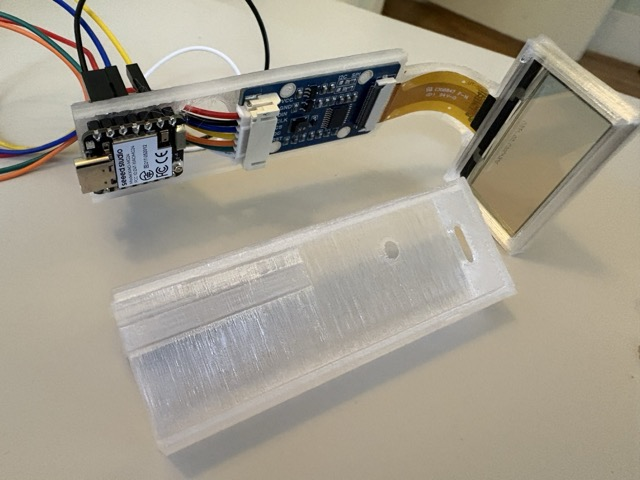

# Reverse HUD
Design files and code for the Reverse HUD.  https://jaykasberger.com/projects/reverse-hud/

This device provides a transparent heads-up display, though it doesn't include the necessary optics
for use as an actual first-person HUD - it's more of a fun costume piece, and/or a way to display
information to the people around you.

## Safety Note and Disclaimer

These files and instructions are for demonstration only.  **Build and use this at your own risk.** 
Operating any kind of equipment close to your eye is inherently dangerous.

## Bill of Materials

- Waveshare transparent OLED display component: https://www.waveshare.com/1.51inch-transparent-oled.htm
- Seeed Studio XIAO MG24 Sense: https://www.seeedstudio.com/Seeed-XIAO-MG24-Sense-p-6248.html  _(Note: you will need one with pre-soldered headers, or you can add them yourself)_
- M3 socket cap screws (3)
- M3 heat-set inserts (3)
- USB-C cable
- USB charging battery

## Build Instructions

- Print the enclosure STLs using the 3D printer of your choice.  I recommend transparent PCTG or PETG.
- Using a soldering iron and the proper attachment, secure the heat-set inserts into the matching holes in the shroud.
- Fit the OLED display screen into the screen area of the frame, making sure the display faces outwards (see photo).
- Run the ribbon cable through the curved guide.  Snap the controller board in place - the pegs in the enclosure will friction-fit with the mounting 
holes in the board, but you can melt the pegs a little to permanently secure the board if needed.
- Snap the screen retainer in place behind the display screen.
- Run the wires from the Waveshare board through the large hole in the enclosure.
- Plug the MG24's headers into the matching holes in the enclosure so that the USB connector is facing away from the display screen.
- Connect the wires from the Waveshare to the MG24 as follows:
- - VCC -> 3V3
- - GND -> GND
- - DIN -> D10
- - CLK -> D8 
- - CS  -> D1
- - DC  -> D3
- - RST -> D2
- Slide the cover over the enclosure.
- Attach the unit to the left temple of a pair of glasses and use the socket cap screws to secure it in place.  You might not need (or be able to use) all three screws.
- Use the Arduino toolchain or IDE to load hud_multimode.ino onto the Seeed board.  You may want to edit it first to provide your own URL for the QR code.  Also, you may have to load the board specification from Seeed, as well as several libraries including ArduinoFFT.
- Plug in the USB battery, and you're running.

## Usage

Pretty simple - just tilt your head to the side to switch modes.  
The modes available are:

- Starfield animation
- Artificial horizon
- Real-time audio spectrogram
- QR code (for your LinkedIn, website, etc.)
- Simultaneous time on Earth and Mars (note: this device doesn't set the time from NTP, so it won't be accurate)

There's an easter egg in the "starfield" display; try whistling the first three notes of the "Star Trek" intro music.
